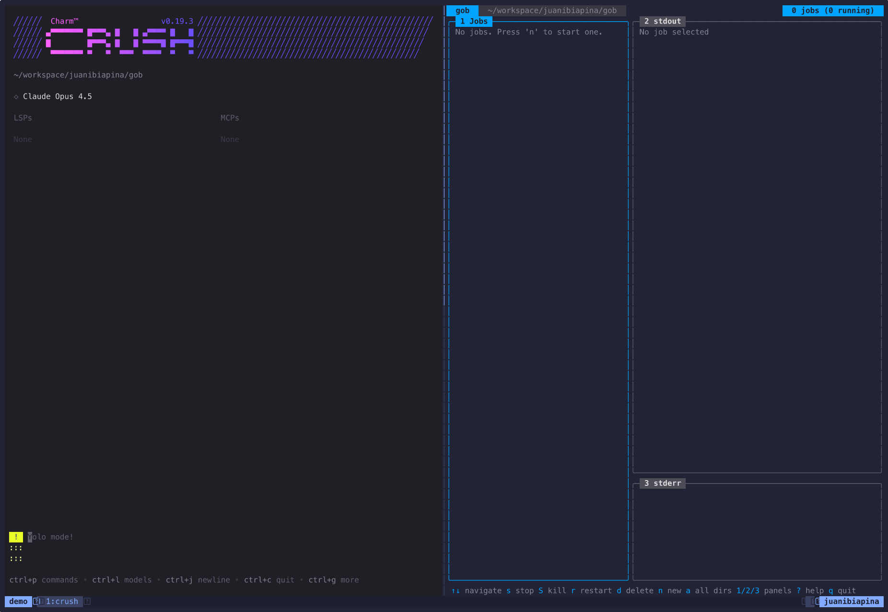
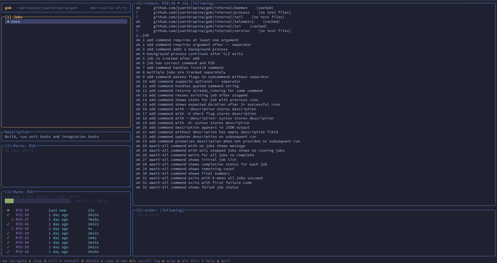

# gob

[](https://goreportcard.com/report/github.com/juanibiapina/gob)


[](https://github.com/juanibiapina/gob/graphs/contributors)


> Background job management for humans and AI agents.

`gob` (pronounced job, of course) is a CLI for managing background processes with a shared interface for you and your AI coding agent.

Start a dev server with Claude Code, check its logs yourself. Or vice-versa. The agent can monitor what you started. Everyone has the same view.

No more "can you check if that's still running?" No more copy-pasting logs through chat. Just direct access to your processes, for everyone.



[View on asciinema](https://asciinema.org/a/OgSVPWybeSvXcQVyLQ0mie8P2)

## Features

- **Interactive TUI** - Full-screen terminal interface with real-time job status and log streaming
- **AI agent friendly** - Shared view of all processes for you and your coding agent
- **Real-time sync** - Changes from CLI instantly appear in TUI, and vice-versa
- **Per-directory jobs** - Jobs are scoped to directories, keeping projects organized
- **Process lifecycle control** - Start, stop, restart, send signals to any job

## Installation

### Using Homebrew

Install gob via Homebrew:

```bash
brew tap juanibiapina/taps
brew install gob
```

### Using Go Install

If you have Go installed, you can install `gob` with a single command:

```bash
go install github.com/juanibiapina/gob@latest
```

Requirements:
- Go 1.25.4 or later

The binary will be installed to `$GOPATH/bin` (or `$GOBIN` if set). Make sure this directory is in your `PATH`.

### Pre-built Binaries

Download the latest release for your platform from the [Releases page](https://github.com/juanibiapina/gob/releases).

**Available platforms**: Linux, macOS (both amd64 and arm64)

```bash
# Download the appropriate binary for your platform
# For example, macOS Apple Silicon (arm64):
curl -LO https://github.com/juanibiapina/gob/releases/latest/download/gob_VERSION_darwin_arm64.tar.gz

# Extract the archive
tar -xzf gob_VERSION_darwin_arm64.tar.gz

# Move to your PATH
sudo mv gob /usr/local/bin/

# Verify installation
gob --version
```

### Build from Source

For build instructions, see [CONTRIBUTING.md](CONTRIBUTING.md).

## Shell Completion

`gob` supports shell completion for Bash, Zsh, Fish, and PowerShell. Completions include dynamic job ID suggestions with command descriptions.

### Bash

```bash
# Add to ~/.bashrc
source <(gob completion bash)
```

### Zsh

```bash
# Add to ~/.zshrc
source <(gob completion zsh)
```

If you get "command not found: compdef", add this before the source line:
```bash
autoload -Uz compinit && compinit
```

### Fish

```bash
# Add to ~/.config/fish/config.fish
gob completion fish | source
```

### PowerShell

```powershell
# Add to your PowerShell profile
gob completion powershell | Out-String | Invoke-Expression
```

## Quick Start

```bash
# Usage overview
gob

# Run a command and wait for it to complete
gob run make test
gob run pnpm --filter web typecheck

# Add a background job (for long-running processes)
gob add python -m http.server 8000

# List all jobs
gob list

# View stdout output
gob stdout abc

# Stop a job
gob stop abc

# Clean up all stopped jobs
gob cleanup
```

## Using with AI Coding Agents

To make `gob` available to AI coding agents, add the following instructions to your agent's configuration file (`CLAUDE.md`, `AGENTS.md`, etc).

```markdown
## Background Jobs with `gob`

Use `gob` to manage background processes.

**When to use `run` (blocks until complete):**
- Running tests: `gob run make test`
- Build commands: `gob run make build`
- Linting/formatting: `gob run npm run lint`
- Commands with flags work directly: `gob run pnpm --filter web typecheck`
- Any command where you need to see the result before proceeding

**When to use `add` (returns immediately):**
- Dev servers: `gob add npm run dev`
- Watch modes: `gob add npm run watch`
- Long-running services: `gob add -- python -m http.server`
- Any command that runs indefinitely

**Note:** `add` requires `--` before commands with flags (e.g., `gob add -- cmd --flag`). `run` does not need this.

**Commands:**
- `gob run <command>` - Run and wait for completion (reuses existing stopped job)
- `gob add <command>` - Add a background job (always creates new)
- `gob await <job_id>` - Wait for job completion, show output and summary
- `gob await-any` - Wait for any job to complete (first one wins)
- `gob await-all` - Wait for all jobs to complete
- `gob list` - List jobs with IDs and status
- `gob stdout <job_id>` - View stdout output
- `gob stderr <job_id>` - View stderr output
- `gob stop <job_id>` - Stop a job (use `--force` for SIGKILL)
- `gob start <job_id>` - Start a stopped job
- `gob restart <job_id>` - Restart a job (stop + start)
- `gob cleanup` - Remove stopped jobs
```

## Interactive TUI

Launch a full-screen terminal interface for managing jobs:

```bash
gob tui
```



### Layout

The TUI has three panels:

- **Panel 1 (Jobs)**: List of all jobs with status (● running, ○ stopped)
- **Panel 2 (stdout)**: Standard output of selected job (80% height)
- **Panel 3 (stderr)**: Standard error of selected job (20% height)

### Key Bindings

Press `?` in the TUI to see all keyboard shortcuts.

## CLI Reference

Run `gob <command> --help` for detailed usage, examples, and flags.

| Command | Description |
|---------|-------------|
| `run <cmd>` | Run command, wait for completion (reuses stopped jobs) |
| `add <cmd>` | Start background job (use `--` before flags: `add -- cmd --flag`) |
| `await <id>` | Wait for job, stream output, show summary |
| `await-any` | Wait for any job to complete (`--timeout`) |
| `await-all` | Wait for all jobs to complete (`--timeout`) |
| `list` | List jobs (`--all` for all directories) |
| `stdout <id>` | View stdout (`--follow` for real-time) |
| `stderr <id>` | View stderr (`--follow` for real-time) |
| `logs` | Follow all output for current directory |
| `stop <id>` | Stop job (`--force` for SIGKILL) |
| `start <id>` | Start stopped job |
| `restart <id>` | Stop + start job |
| `signal <id> <sig>` | Send signal (HUP, USR1, etc.) |
| `remove <id>` | Remove stopped job |
| `cleanup` | Remove all stopped jobs |
| `nuke` | Stop all, remove all, shutdown daemon |
| `tui` | Launch interactive TUI |

## Contributing

Interested in contributing? Check out [CONTRIBUTING.md](CONTRIBUTING.md) for development setup, testing instructions, and contribution guidelines.

## Star History

[](https://star-history.com/#juanibiapina/gob&Date)
