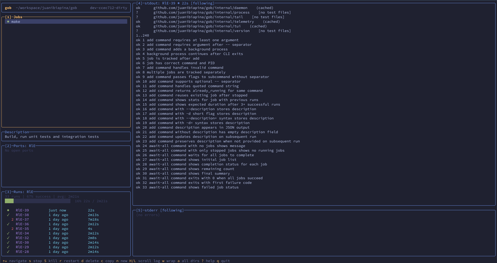

# gob

[](https://github.com/juanibiapina/gob/releases)
[](https://goreportcard.com/report/github.com/juanibiapina/gob)


[](https://github.com/juanibiapina/gob/graphs/contributors)

[](https://deepwiki.com/juanibiapina/gob)

> Process manager for AI agents (and humans).

**`gob` lets your AI coding agent start background processes and inspect them later.** The agent starts a dev server or a build, then reads its logs, status, and ports on a later turn. (Pronounced *job*, of course.) You can also start and inspect backgroud jobs yourself.



## Why gob

`gob` replaces ad-hoc backgrounding (`&`, `nohup`, stray tmux panes, scrollback) with a managed job store that you and your agent both read and control. That single idea buys:

- **Shared view** - You and your coding agent see the same processes, logs, and status.
- **Real-time log streaming** - Follow stdout/stderr from CLI, TUI, or agent without copying output.
- **Real-time sync** - Changes from the CLI appear instantly in the TUI, and vice-versa.
- **Interactive TUI** - Full-screen terminal interface with live job status.
- **Per-directory jobs** - Jobs are scoped to directories, keeping projects organized.
- **Process lifecycle control** - Start, stop, restart, and signal any job.
- **Port monitoring** - Inspect listening ports across a job's entire process tree.
- **Reliable shutdowns** - Stop, restart, and shutdown verify every child in the tree is gone.
- **Job persistence** - Jobs survive daemon restarts with SQLite-backed state.
- **Run history** - Track execution history, statistics, and progress estimates for repeated commands.
- **Stuck detection** - Detects jobs that may be stuck and returns early, while the job keeps running.
- **Blocked jobs** - Prevent agents from accidentally running dangerous commands.

## Installation

Install `gob` with Homebrew, `go install`, or a pre-built binary.

<details>
<summary>Homebrew</summary>

```bash
brew tap juanibiapina/taps
brew install gob
```

</details>

<details>
<summary>Go Install</summary>

```bash
go install github.com/juanibiapina/gob@latest
```

Requirements:
- Go 1.25.4 or later

The binary will be installed to `$GOPATH/bin` (or `$GOBIN` if set). Make sure this directory is in your `PATH`.

</details>

<details>
<summary>Pre-built Binaries</summary>

Download the latest release for your platform from the [Releases page](https://github.com/juanibiapina/gob/releases).

**Available platforms**: Linux, macOS (both amd64 and arm64)

```bash
# Download the appropriate binary for your platform
# For example, macOS Apple Silicon (arm64):
curl -LO https://github.com/juanibiapina/gob/releases/latest/download/gob_VERSION_darwin_arm64.tar.gz

# Extract the archive
tar -xzf gob_VERSION_darwin_arm64.tar.gz

# Move to your PATH
sudo mv gob /usr/local/bin/

# Verify installation
gob --version
```

</details>

<details>
<summary>Build from Source</summary>

See [CONTRIBUTING.md](CONTRIBUTING.md) for build instructions.

</details>

## Quick Start

The everyday flow is one of two shapes: **run and wait**, or **add and come back later**.

```bash
# Usage overview
gob

# Run a command and wait for completion
gob run make test

# Add a background job (returns immediately)
gob add -- make test
gob add -- pnpm --filter web typecheck

# Wait for a job to complete
gob await abc

# List all jobs
gob list

# View stdout and stderr
gob logs abc

# Stop a job
gob stop abc

# Remove a stopped job
gob remove abc
```

## Using with AI Coding Agents

`gob` ships an agent skill with instructions for AI coding agents. Install it with the [skills CLI](https://skills.sh):

```bash
npx skills add juanibiapina/gob
```

This makes the gob instructions available to your agent (Claude Code, Cursor, Codex, and others). The skill lives at [`skills/gob/SKILL.md`](skills/gob/SKILL.md); you can also copy its contents into your agent's configuration file (`CLAUDE.md`, `AGENTS.md`, etc.).

## Interactive TUI

When you want to watch and control jobs directly, launch the full-screen terminal interface:

```bash
gob tui
```

### Layout

The TUI has an info bar and five panels:

- **Info bar**: Shows working directory and version
- **Panel 1 (Jobs)**: List of all jobs with status (◉ running, ✓ success, ✗ failed)
- **Description**: Shows job description (only visible when selected job has one)
- **Panel 2 (Ports)**: Listening ports for the selected job
- **Panel 3 (Runs)**: Run history for the selected job
- **Panel 4 (stdout)**: Standard output of selected run
- **Panel 5 (stderr)**: Standard error of selected run

### Key Bindings

| Key | Action |
|-----|--------|
| `↑/k`, `↓/j` | Navigate / scroll |
| `h/l` | Scroll log horizontally (in log panels) |
| `H/L` | Scroll log horizontally (from jobs/runs panels) |
| `g/G` | Go to first/last |
| `f` | Toggle follow mode |
| `w` | Toggle line wrap |
| `s/S` | Stop / kill job |
| `r` | Restart job |
| `d` | Delete stopped job/run |
| `n` | New job |
| `1/2/3/4/5` | Switch to panel |
| `?` | Show all shortcuts |
| `q` | Quit |

Process-control keys (`s`/`S`/`r`/`d`) act on the selected job from any panel. The only exception is `d` in the Runs panel, where it deletes the selected run.

### Auto-Start with Gobfile

To start a project's usual jobs automatically when the TUI launches, create a `.config/gobfile.toml` in the project directory:

```toml
[[job]]
command = "npm run dev"
description = "Frontend on http://localhost:3000. Check here for UI errors."

[[job]]
command = "npm run api"
description = "API server on http://localhost:4000. Check logs for request debugging."

[[job]]
command = "npm run storybook"
description = "Component library on http://localhost:6006"
autostart = false  # Add but don't start automatically

[[job]]
command = "npm run db:reset"
description = "DANGER: Drops and recreates the database"
blocked = true  # Prevent accidental execution
```

**Fields:**
- `command` (required): The command to run
- `description` (optional): Context for AI agents (ports, URLs, what to check for)
- `autostart` (optional): Whether to start the job when TUI opens (default: `true`)
- `blocked` (optional): If `true`, the job cannot be started; CLI shows description when attempted (default: `false`)

**Behavior:**
- Jobs are started asynchronously when TUI opens (if `autostart = true`)
- Jobs are stopped when TUI exits (including when terminal is killed)
- Already-running jobs have their descriptions updated if different
- Stopped jobs with matching commands are restarted
- Jobs with `autostart = false` are added but not started

**Tip:** Add `.config/gobfile.toml` to `.gitignore` if you don't want to share it.

## CLI Reference

Run `gob <command> --help` for detailed usage, examples, and flags.

| Command | Description |
|---------|-------------|
| `run <cmd>` | Run command and wait for completion (`--description` to add context) |
| `add <cmd>` | Start background job (`--description` to add context) |
| `await <id>` | Wait for job, stream output, show summary |
| `list` | List jobs (`--all` for all directories) |
| `runs <id>` | Show run history for a job |
| `runs delete <run_id>` | Delete a stopped run and its logs |
| `stats <id>` | Show statistics for a job |
| `stdout <id>` | View stdout (`--follow` for real-time) |
| `stderr <id>` | View stderr (`--follow` for real-time) |
| `logs [id]` | View stdout and stderr (`--follow` for real-time) |
| `ports [id]` | List listening ports (`--all` for all jobs) |
| `stop <id>` | Stop job (`--force` for SIGKILL) |
| `start <id>` | Start stopped job |
| `restart <id>` | Stop + start job |
| `signal <id> <sig>` | Send signal (HUP, USR1, etc.) |
| `remove <id>` | Remove stopped job |
| `shutdown` | Stop all running jobs, shutdown daemon |
| `tui` | Launch interactive TUI |

## Shell Completion

gob provides live job-ID suggestions with command descriptions as you type.

**Homebrew installs completions automatically** for Bash, Zsh, and Fish — no setup needed. Just start a new shell.

For manual installs, write the completion script once to a file on your shell's completion path. Don't `source <(gob completion ...)` from your shell rc: that spawns gob on every new shell and slows startup. Generate the file instead, and regenerate it only when you upgrade gob.

<details>
<summary>Bash</summary>

```bash
gob completion bash > "$(brew --prefix 2>/dev/null || echo /usr/local)/etc/bash_completion.d/gob"
```

</details>

<details>
<summary>Zsh</summary>

```bash
# Write to a directory on your fpath (must be listed in fpath before compinit runs)
mkdir -p ~/.zsh/completions
gob completion zsh > ~/.zsh/completions/_gob
# In ~/.zshrc, before `compinit`:
#   fpath=(~/.zsh/completions $fpath)
```

</details>

<details>
<summary>Fish</summary>

```bash
gob completion fish > ~/.config/fish/completions/gob.fish
```

</details>

## Contributing

Interested in contributing? Check out [CONTRIBUTING.md](CONTRIBUTING.md) for development setup, build instructions, testing instructions, and contribution guidelines.

## Star History

[](https://star-history.com/#juanibiapina/gob&Date)
